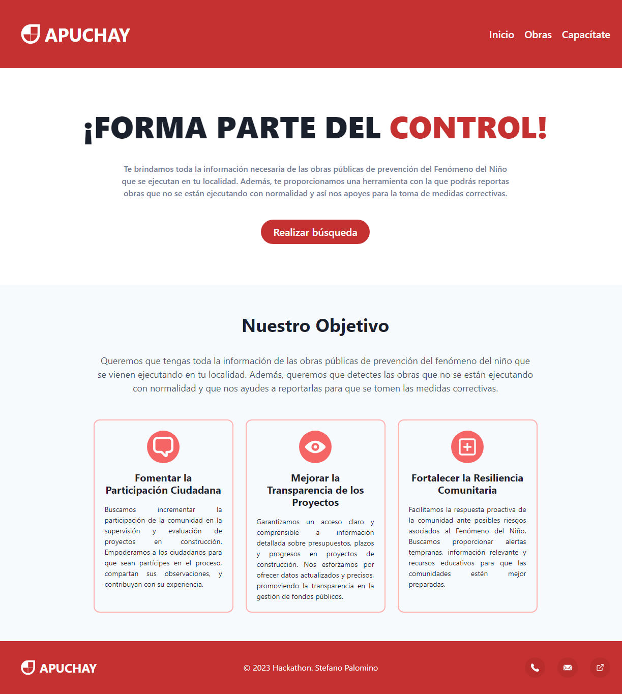

# Apuchay



Aplicación web para mejorar el control de las obras públicas. La aplicación cuenta con una interfaz orientada al ciudadano común. Además, cuenta con un sistema de autenticación de usuarios, protección de rutas, reportes de obras y cursos de capacitación online.

### Instalación

Clona el repositorio y navega hasta el directorio:

```bash
git clone https://github.com/StefanoP21/apuchay.git
```

### Instala las dependencias:

```bash
npm install
#or
yarn add
```

### Variables de Entorno

Cree un archivo .env en la carpeta raíz de su proyecto y añada sus variables. Consulte .env.template para obtener ayuda.

### Ejecución en modo de desarrollo

Para iniciar la aplicación en modo de desarrollo, ejecuta:

```bash
npm run dev
#or
yarn dev
```

### Ejecución de las pruebas

Para iniciar las pruebas de la aplicación, ejecuta:

```bash
npm run test
#or
yarn test
```

### Ejecución en modo de producción

Para construir la aplicación para producción, ejecuta:

```bash
npm run build
#or
yarn build
```

### Tecnologías

- [TypeScript](https://www.typescriptlang.org/)
- [React](https://es.react.dev/)
- [React Router](https://reactrouter.com/)
- [TanStack Query](https://tanstack.com/query/latest)
- [Chakra UI](https://chakra-ui.com/)
- [React Hook Form](https://react-hook-form.com/)

### Autor

- [Stefano Palomino](https://github.com/StefanoP21)

### Licencia

Este proyecto está disponible para su uso bajo la Licencia MIT.
